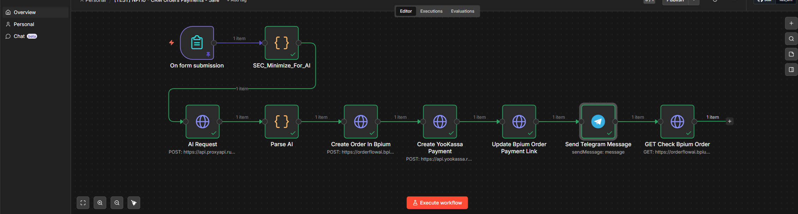

# Скриншот workflow

## Назначение

Этот файл фиксирует актуальную визуальную схему автоматизации, которая передается заказчику или другому специалисту вместе с JSON-экспортом и документацией.

Скриншот нужен, чтобы быстро понять общую структуру workflow без импорта сценария в n8n.

## Файл скриншота

`02_architecture_workflow_screenshot.png`

## Что видно на схеме

На скриншоте показан безопасный вариант сценария `[TEST] NPr10 - CRM Orders Payments - Safe`.

Основная цепочка:

1. `On form submission` принимает заявку клиента.
2. `SEC_Minimize_For_AI` оставляет для AI только минимально необходимые данные.
3. `AI Request` отправляет обезличенный запрос в модель через ProxyAPI.
4. `Parse AI` разбирает JSON-ответ модели.
5. `Create Order In Bpium` создает заказ в CRM.
6. `Create YooKassa Payment` создает платеж.
7. `Update Bpium Order Payment Link` сохраняет ссылку на оплату в CRM.
8. `Send Telegram Message` отправляет менеджеру уведомление без персональных контактов клиента.
9. `GET Check Bpium Order` проверяет результат создания/обновления заказа.

